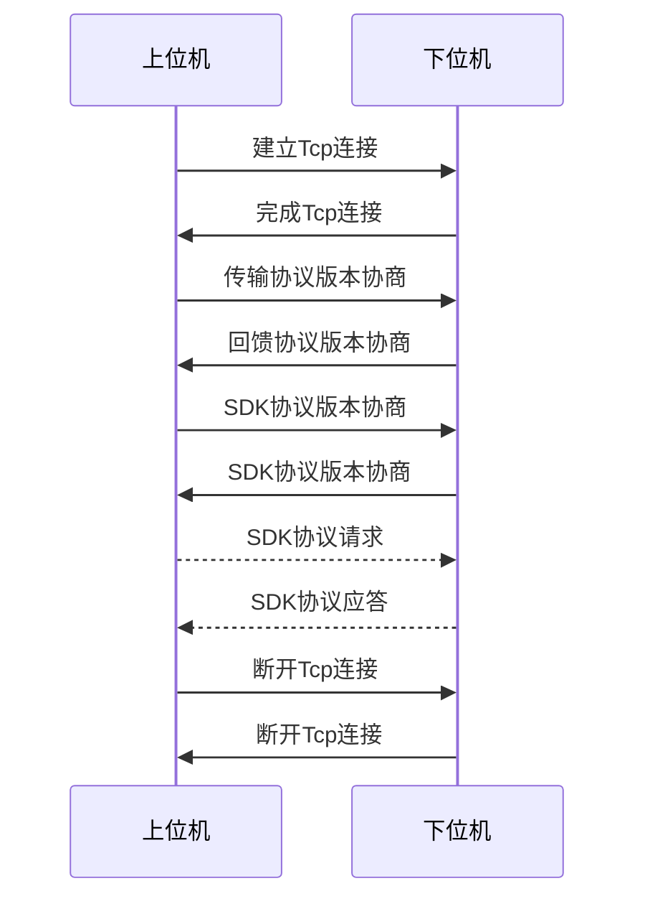

# SDK协议流程

> 注: SDK协议通信不能和发送文件数据交叉发送
> 
> 比如发送文件时, 必须等文件发送完, 在最后接收到发送文件结束确认后才能继续下发SDK信息
> 
> 如果在发送文件中突然插入一条SDK信息, 则该连接将被置位非法操作连接, SDK协商将被取消, 可断开连接重新进行SDK协商.

1. 先建立Tcp连接

2. 进行协议版本交互

3. 进行SDK信息交互, 当一段时间未进行SDK信息交互需互发心跳包维持连接

4. 不再进行SDK交互后关闭Tcp连接

## 版本协商

1. 上位机发送版本协商包, 版本号为 **LOCAL_TCP_VERSION**
2. 下位机收到版本协商包后, 提取版本号, 
   - 如版本号小于下位机支持的最低版本号, 返回 **传输协议版本过低的错误信息** 
   - 如版本号大于下位机支持的最高版本号, 返回下位机最高版本号, 上位机设置下位机返回的最高版本号
   - 如版本号在下位机支持列表, 则下位机自动切换到相同传输协议, 并返回相同的版本号
3. 收到 **传输版本过低** 的错误信息因做断开连接处理

### 协议版本请求

| 字段  | 命令包长度(Len) | 命令(Cmd)            | 版本号(Version)      |
|:---:|:----------:|:------------------:|:-----------------:|
| 字节数 | 2字节        | 2字节                | 4字节               |
| 取值  | 8          | **kSDKServiceAsk** | LOCAL_TCP_VERSION |

### 协议版本反馈

| 字段  | 命令包长度(Len) | 命令(Cmd)               | 版本号(Version) |
|:---:|:----------:|:---------------------:|:------------:|
| 字节数 | 2字节        | 2字节                   | 4字节          |
| 取值  | 8          | **kSDKServiceAnswer** | 反馈值          |

## [SDK版本协商](./SDK版本协商.md)

SDK协议版本协商通过 **[GetIFVersion](./SDK版本协商.md)** SDK获取guid值, 此连接后续SDK通讯都需要使用该guid值来完成SDK请求

> 在SDK协议交互前, 需要获取guid值, 这个值在后续SDK交互中, 需要在xml的sdk标签的guid填入.
> 
> 注意: SDK版本协商走的是SDK协议交互, SDK协议包头都是一样的, 如下面SDK请求的格式.

## SDK协议交互

SDK数据包协议依赖 [协议数据包](./协议数据包结构格式.md) 结构, 每包最大长度都不能找过协议数据包要求

### SDK请求

| 字段  | 命令包长度(Len) | 命令(Cmd)        | 总长度   | 索引    | SDK接口数据 |
|:---:|:----------:|:--------------:|:-----:| ----- | ------- |
| 字节数 | 2字节        | 2字节            | 4字节   | 4字节   | N字节     |
| 取值  | Len        | **kSDKCmdAsk** | Total | index | XmlData |

> Len值: Len = 2 + 2 + 4 + 4 + N;
> 
> Total值为SDK接口数据的总长度
> 
> Index值为当前包SDK接口数据的索引, 比如数据大于协议数据包时需要分包, 第一包是0, 第二包就是xml数据 + 已发的xml数据的偏移位置. 如发送200字节Xml, 分100字节1包, 那么第一包的Index = 0, 第二包的Index = 100;
> 
> XmlData值为SDK接口数据, 最大长度要求和协议包长度, XmlMaxLength = 9 \* 1024 - 2 - 2 - 4 - 4个字节, 就是9 \* 1027 - 包头的长度.

### SDK应答

| 字段  | 命令包长度(Len) | 命令(Cmd)           | 总长度   | 索引    | SDK接口数据 |
|:---:|:----------:|:-----------------:|:-----:| ----- | ------- |
| 字节数 | 2字节        | 2字节               | 4字节   | 4字节   | N字节     |
| 取值  | Len        | **kSDKCmdAnswer** | Total | index | XmlData |

## [错误码反馈格式](./错误码定义.md)

| 字段  | 命令包长度(Len) | 命令(Cmd)          | 错误码(Code)  |
|:---:|:----------:|:----------------:|:----------:|
| 字节数 | 2字节        | 2字节              | 2字节        |
| 取值  | 6          | **kErrorAnswer** | HErrorCode |