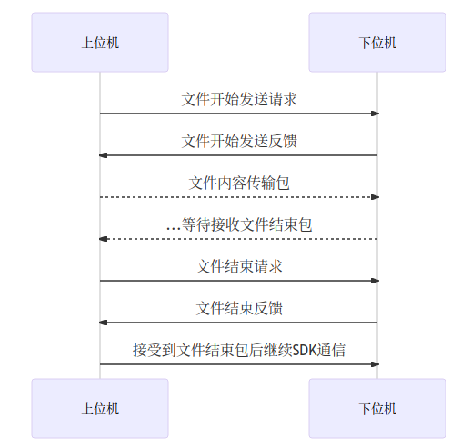
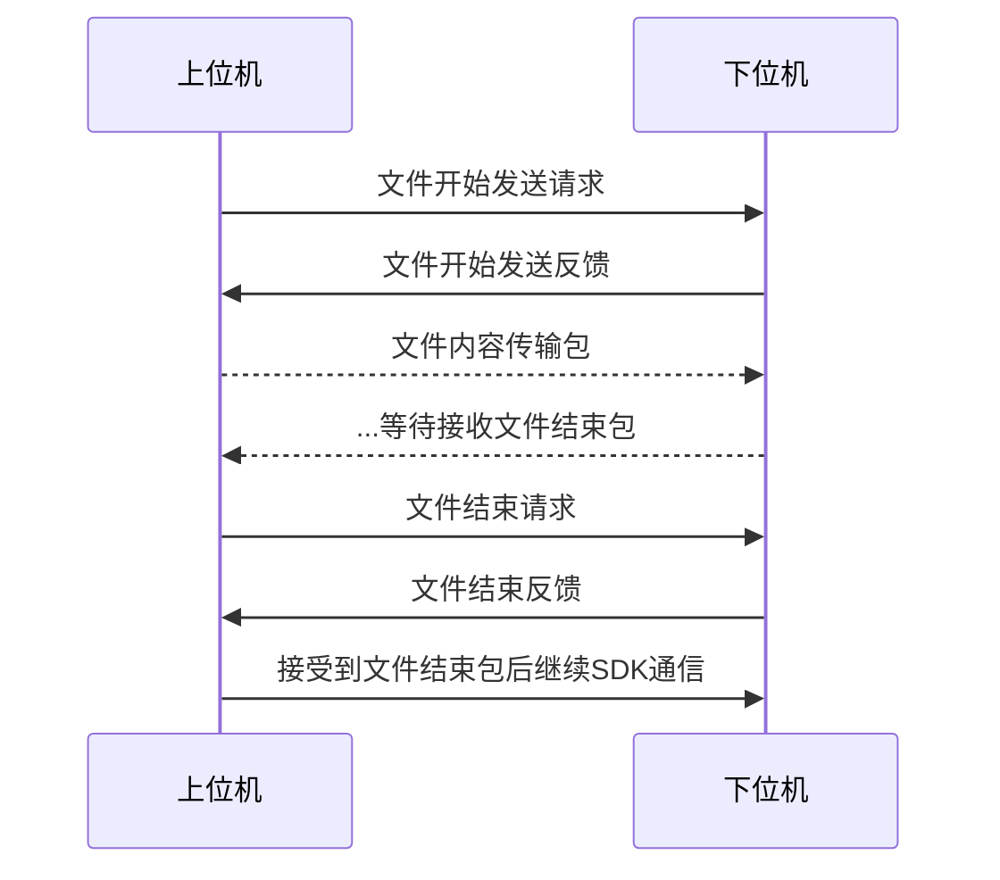

# SDK发送文件流程

> 发送文件必须发送完成, 不能在中途插入SDK数据, 否则这将丢失SDK协商. 并返回流程错误的错误码

### 文件开始发送请求 (安卓系列字体名不一样)

| 字段  | 命令包长度(Len) | 命令(Cmd)           | md5值 | 文件大小 | 文件类型 | 文件名     |
|:---:|:----------:|:-----------------:|:----:|:----:|:----:|:-------:|
| 字节数 | 2字节        | 2字节               | 33字节 | 8字节  | 2字节  | 2-256字节 |
| 取值  | len        | **kFileStartAsk** | md5  | size | type | name    |

> len: 2 + 2 + 33 + 8 + 2 + nameLen
> 
> md5: 表示下发文件的md5值. 小写
> 
> size: 文件大小(字节)
> 
> type: 0(图片), 1(视频), 2(字体), 3(固件), 4(基本配置参数), 5(FPGA配置), 128(临时图片文件), 129(临时视频文件)
> 
> name: 文件名

注: type常用的就0和1(图片和视频), 临时文件是存放到内存的, 总大小不能超过10MB.

### 文件开始发送反馈

| 字段  | 命令包长度(Len) | 命令(Cmd)              | 错误码                      | 已存在大小     |
|:---:|:----------:|:--------------------:|:------------------------:|:---------:|
| 字节数 | 2字节        | 2字节                  | 2字节                      | 8字节       |
| 取值  | 8          | **kFileStartAnswer** | [HErrorCode](./错误码定义.md) | existSize |

> 当错误码不等于0(kSuccess)时, 需检查错误码, 并发送结束文件包中断传输.
> 
> existSize: 当设备已存在时, 不能再发已存在数据, 而是补发缺少的数据(用于断点续传, 减少消耗的发送流量)

### 文件内容传输

| 字段  | 命令包长度(Len) | 命令(Cmd)             | 文件内容                 |
|:---:|:----------:|:-------------------:|:--------------------:|
| 字节数 | 2字节        | 2字节                 | 1 ~ (9 * 1024 - 4)字节 |
| 取值  | len        | **kFileContentAsk** | data                 |

> 文件数据包不允许超过每包大小.

### 文件结束请求

| 字段  | 命令包长度(Len) | 命令(Cmd)         |
|:---:|:----------:|:---------------:|
| 字节数 | 2字节        | 2字节             |
| 取值  | 4          | **kFileEndAsk** |

> 当完成发送或者结束发送文件时, 必须发送文件结束请求, 用于文件检查和状态校验

### 文件结束反馈

| 字段  | 命令包长度(Len) | 命令(Cmd)            | 错误码                      |
|:---:|:----------:|:------------------:|:------------------------:|
| 字节数 | 2字节        | 2字节                | 2字节                      |
| 取值  | 6          | **kFileEndAnswer** | [HErrorCode](./错误码定义.md) |

> 当文件结束反馈回送后, 错误码为0(kSuccess)时, 设备状态才会切换会SDK通信状态, 此时才能进行SDK通信.
> 
> 如报错. 请检查对应错误
